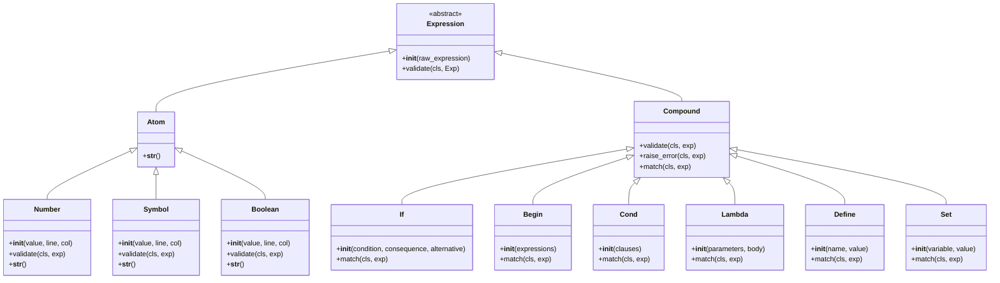

## 前言
在看完《流畅的python》lispy(一个python写的lisp语言解释器)后，对lisp语言突然饶有兴趣，让我想到了之前那时觉得并不好看的《计算机程序的构造和解释》，于是捡着感兴趣的部分（前四章）了解了下lisp语言设计思想，觉得更近一步了解了函数式语言的特点，也很喜欢lisp这种简洁的设计思想。在这段时间萌发了用python(自己比较熟悉的语言)写个lisp语言解释器的想法，不过由于没有仔细阅读官方要求的lisp语言规范，该项目可能更多的实现的是我自己理解的lisp语言（当然也有尽力向lisp语言标准靠拢），此外本项目本着精简的设计原则可能会略微一点运行效率。

# 程序语言的构造与解释
## 程序语言的构造
### 1. **符号（Symbol）**：

用于表示变量、函数名或其他标识符。例如，`x`、`foo` 和 `bar` 都是符号。用来标识和操作程序中的各种实体。

### 2. **数字（Number）与 布尔值（Boolean values）**
**注**：为了简化设计该项目中的数字都用float实现，这可能会导致精度的丢失  
```#t```为真，```#f```为假（这是唯一的真假值）

### 3. **列表（List）**：

用于存储和操作多个元素。列表由一对圆括号括起来，内部的元素用空格分隔，例如：`(1 2 3)`。
#### 提供的操作接口
- **list** 函数用于返回元素列表。```(list 1 2 3)->(1 2 3)```
- **car** 函数用于返回列表的第一个元素。```(car (1 2 3))->1```
- **cdr** 函数用于返回列表除第一个元素之外的部分，即列表的“尾部”。```(cdr (1 2 3)->(2 3))```
- **set-cdr!** 用于修改列表的 cdr 部分
- **set-car!** 用于修改列表的 car 部分

**注**：本项目没有提供cons的实现，因为个人认为list能实现cons的所有功能，如果为了引进cons，而按照标准(list 1 2)<=>(cons 1 (cons 2 '()))
为了兼容这一规则，就要被迫处理'()的情况，不能简单直接的将python的list与lisp的list直接形成对应

### 4. **过程（Procedure）**：

接受参数返回结果的函数
#### 基本过程
语言内置的、无法再进一步分解的最基本的函数。执行时参数是严格的（即参数先计算出最终结果后代入）。

- 运算符号：+ - * /
- 逻辑符号：and or not
- 位运算符号：^ & | ~ << >>
- 比较运算符号：> >= <=  = != eqv? equal?
- 输出：display
- 输入：read 注:(read)后输入值（该语言下的表达式）将读取并返回读取的值

#### 复合过程
由基本过程或其他复合过程通过组合而构成的新的过程（用户定义的都为复合过程），参数是否严格可由用户自定义。
内置的的复合过程：list car cdr
注：虽然说看上去 list car cdr 是语言内置的最基本的函数把他定义为基本过程似乎更为合适，但是另一方面该数据结构完全可以用过程的方式写出来如下
```lisp
(define (cons x y)
    (lambda (m) (m x y)))
(define (car z)
    (z (lambda (p q) p)))
(define (cdr z)
    (z (lambda (p q) p)))
``` 
那么 (list 1 2 3)就可以看作是（cons (1 cons(2 cons(3 '())))）  
此外另一个考量是把 list 的参数是否严格交给用户定义可以实现流的数据结构

### 5. **关键字**
#### 控制流相关
##### if
(if \<predicate\> \<consequent\>\<alternative\>)   
在本解释器中仅仅会去计算符合条件的部分。
##### begin
(begin \<expression1\> \<expression2\> ... \<expressionN\>)  
顺序地执行多个表达式，并返回最后一个表达式的结果。
##### cond
(cond (\<predicate1\> \<expression1\>)  
      (\<predicate2\> \<expression2\>)  
      ...  
      (\<predicateN\> \<expressionN\>))  
它会依次检查每个 <predicate>，并执行第一个为真的条件对应的 <expression>。都不满足返回假。

#### 抽象相关
**注**：这里的变量（name parameter）都应该是symbol
##### lambda
用于创建匿名过程，返回body块中的最后一条语句的值  
(lambda (parameter1 parameter2 ... parameterN)  
   body)

##### define 
在当前环境中给变量或过程绑定上别名
- 定义变量 (define variable-name value)
- 定义函数 (define (function-name parameter1 parameter2 ... parameterN) body)  
  可以看作是 （define function-name (lambda (parameter1 parameter2 ... parameterN) body)）

#### 赋值相关
##### set!
用于改变数据的状态  
(set! variable new-value)
##### set-car! 与 set-cdr!
(set-car! list new-value)

#### 元编程相关
##### quote or '
用于将表达式的含义限定为字面意思  
比如：（+ 1 2）的含义是3，'(+ 1 2)等价于quote((+ 1 2))含义是一个列表其中元素分别是 +、1、2

## 程序语言的解释
### shell
提供类似ipython的交互式输入求值循环
- 具有关键字补全功能（使用tab键）
- define变量成功后变量名会加入代补全列表
- 输入左括号自动补全右括号
- 一次仅执行一个表达式（如果具有多个表达式，请用begin连接）
- 未执行表达式（不完整表达式也会被拒绝执行）将会表达式将会保留在输入中
- 非末尾处换行，自动补齐两空格缩进，末尾换行终止输入
- 括号未成对匹配则换行不终止输入

### interpreter
```python
def interpret(source:str,max_in:int=100,eval_time:int=1)->tuple[str,str,set[str]]:
    ...
```
**输入值**
- source:输入来源
- max_in:每次处理source的字符量
- eval_time:执行次数达eval_time则返回
**返回值**
- result:返回结果
- left:未处理字符串
- env_variable:当前环境下用户自定义的名称
```
                      /--------------------------------------\  
          source------|-> StrGen          StopIteration      |  
            ∧         |    |(str)              |             |  
            |         |    v                   v             |  
            |         | TokenGen          StopIteration      |  
            |         |    |(Token)            |             |  
            |         |    v                   v             |  
            |         |  AstGen            AstException      |  
            |         |    |(Exp)              |             |  
            |         |    v                   v             |  
            |         |  Analyzer          AstException      |  
            |         |    |(Expression) AnalysisException   |  
            |         |    |                   |             |  
            |         |    v                   v             |  
            |         |   Eval           AstException        |  
            |         |    |(Result)   AnalysisException     |  
            |         |    v             EvalException       |  
            |         |    |                   |             |  
            |         |  interpret <-----------/             | 
            |         |    |                                 |   
  input--> shell <----|--<-/                                 |  
            |         \--------------------------------------/  
            v  
          output  
```

#### StrGen
将source源转换为迭代器
```python
def StrGen(source: str, max_in: int):
    start = 0
    while start < len(source):
        yield source[start:start + max_in]
        start += max_in
```
注：迭代器消耗完将会raise StopIteration

#### TokenGen
**Token**
维护line与col用来优化报错提示，以及后期返回未处理字符串
```python
class Token(NamedTuple):
    value: str
    line: int
    col: int
```
**TokenGen**
持续从StrGen流中获取字符并形成Token流  
单词以```{'(',')',' ','\n','\''}```作为分割
```python
def TokenGen(strgen: Generator[str, None, None]):
    col,line=0,1
    pending=''
    finished=[]
    for string in strgen:
        for i in string:
            # process
        yield finished
        
        finished=[]
```

#### AstGen
**Exp**
一个由Token为叶节点的树
```python
Exp:TypeAlias=Token|list[Exp]
```

**AstGen**
从TokenGen流中获取Token并形成Exp流  
```python
def AstGen(tokengen:Generator[Token,None,None]):
    def Ast(tokengen:Generator[Token,None,None])->Exp:
        #将token拼装为一个Exp
        stack:list[Token]=[] 
        result=None
        while True:
            # 递归的处理()内部的表达式
            if not stack:
                break
        return result
    while True:
        yield Ast(tokengen)
```
#### Analyzer
将简单的Exp进行更深一步的语法分析，将其识别为具体的句式  

- Atom为原子表达式仍保留有位置信息
- ATOM 存放atom的列表按照 Number Boolen Symbol的顺序不宜打乱
- Compound为由关键字开头的表达式
- ListExp为剩下的表达式

##### 其中类与analyze关系如下
```

  ----------------
  |    class     |           ---------
  | - validate <-|-(递归调用)-|analyze|----->Expression 
  ----------------           ---------
         |                     ∧   ∧ 
         |                     |   |
         |     (依次调用class_list中的validate,对Exp进行识别)
         v                     |   |
     class_list-----------------  Exp

```
#### Eval
由于执行错误发生在执行的那一刻，所以在eval后Symbol、Number、Boolean、List这些 lisp 中的基本结构将被去除位置信息完全的转为解释器所提供的对应形式

**lisp中的type与解释器内的对应**：
- **list** 直接对应 python 的 list
- **symbol** 对应 python 中的 str (结合环境语义)
- **Number** 对应 python 中的 float
- **Boolen** 对应 python 中的 True / False


元素 规则 控制流 环境 求值方式

